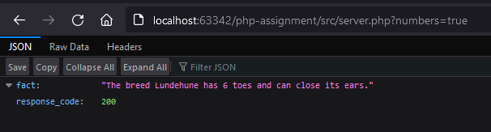
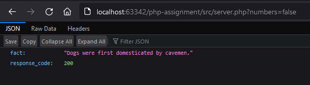
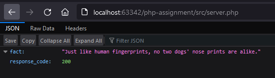
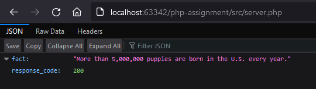

# Random K9s

1. Download (https://www.php.net/downloads.php) and install PHP.
2. Download (https://www.apachefriends.org/download.html) and install XAMPP server.
3. Run XAMPP server and start the Apache Web Server.
4. Clone this repository to C:\xampp\htdocs.

* Facts with numbers - http://localhost/random-k9-tharinda046/src/server.php?numbers=true

* Facts without numbers - http://localhost/random-k9-tharinda046/src/server.php?numbers=false

* Facts with or without numbers - http://localhost/random-k9-tharinda046/src/server.php

